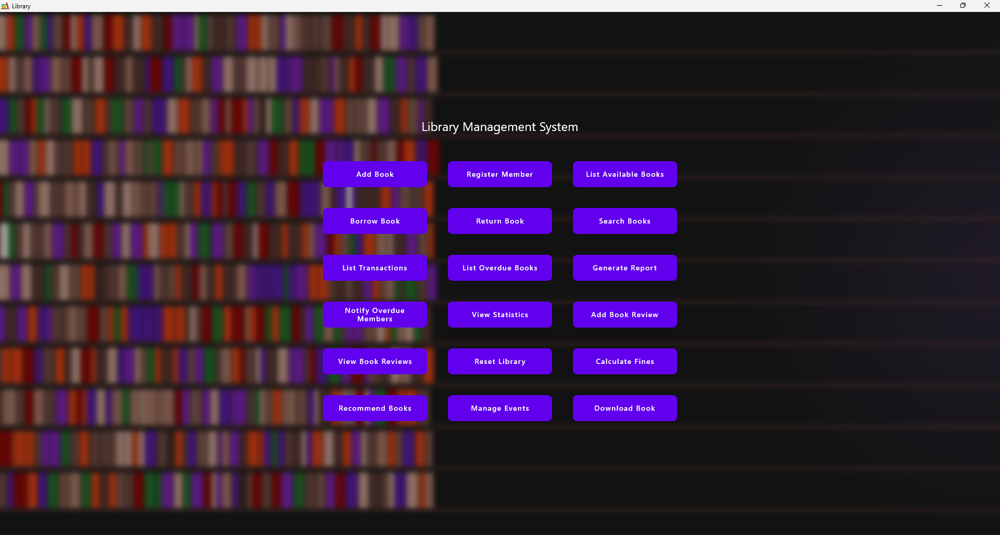
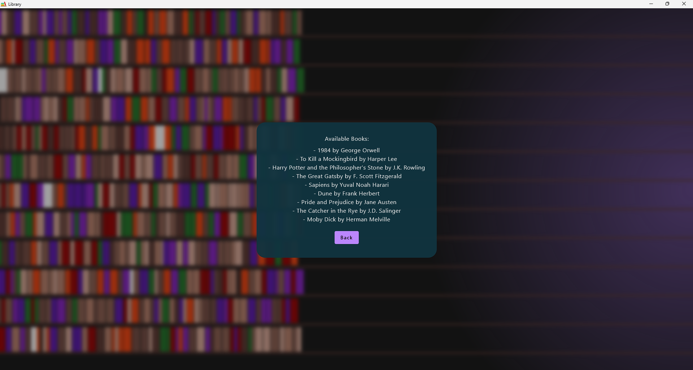
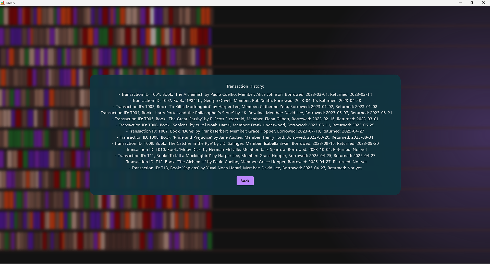

# Library Management System

A modern, feature-rich Library Management System built with Kotlin and Jetpack Compose for Desktop. This application provides an interactive and visually appealing interface for managing books, members, transactions, events, and more. Designed for Windows, it is ideal for libraries, schools, or personal book collections.

## Features

- **Book Management**: Add, remove, search, and list books with genre and year filtering.
- **Member Management**: Register, list, and manage library members.
- **Borrow & Return**: Track book borrowing and returns, with overdue detection and fine calculation.
- **Book Reviews**: Add and view reviews for books.
- **Statistics & Reports**: Generate reports and view statistics on library usage.
- **Event Management**: Organize and list library events.
- **Recommendations**: Get book recommendations by genre and author.
- **Notifications**: Notify members about overdue books.
- **Download & Preview**: Preview and download available books.
- **Animated UI**: Enjoy a beautiful animated library background and modern UI design.

## Screenshots

Below are some screenshots of the application in action.

### Main Menu


### List Available Books


### Transaction History


## Getting Started

### Prerequisites
- [JDK 17+](https://adoptopenjdk.net/)
- [IntelliJ IDEA](https://www.jetbrains.com/idea/) (recommended for Kotlin/Gradle projects)
- [Gradle](https://gradle.org/) (or use the Gradle wrapper)

### Running the App on Windows (Recommended)

1. **Clone the repository:**
   ```sh
   git clone https://github.com/yourusername/library-management-system.git
   cd library-management-system
   ```
2. **Open in IntelliJ IDEA:**
   - Launch IntelliJ IDEA.
   - Select `Open` and choose the project folder you just cloned.
   - Wait for IntelliJ to import the Gradle project and download all dependencies (this may take a few minutes on first run).
   - Make sure the project SDK is set to JDK 17 or higher (File > Project Structure > Project SDK).
3. **Run the Application:**
   - In the Project view, navigate to `src/main/kotlin/project/App.kt`.
   - Open `App.kt` and locate the `main` function.
   - Click the green run arrow next to the `main` function, or right-click and select `Run 'main'`.
   - The application window will launch on your Windows desktop.

**Note:** The application is designed and tested for Windows. For best results, use IntelliJ IDEA Community or Ultimate Edition.

Alternatively, you can run from the command line:
```sh
./gradlew run
```

### Project Structure
- `src/main/kotlin/` — Main source code (UI, logic, models)
- `src/main/data/` — Data files (JSON, downloads, previews)
- `resources/` — App resources (icons, images)
- `assets/` — Screenshots for documentation

## Data Persistence
- Library data is stored in `src/main/data/library.json`.
- Book previews in `resources/previews/`.

## Usage
- Use the main menu to navigate between features such as adding books, registering members, borrowing/returning books, viewing statistics, and more.
- All data is persisted automatically in the JSON file.
- Screenshots in the `assets` folder can be used for documentation or presentations.

## Contribution
Pull requests are welcome! For major changes, please open an issue first to discuss what you would like to change.

1. Fork the repository
2. Create your feature branch (`git checkout -b feature/AmazingFeature`)
3. Commit your changes (`git commit -m 'Add some AmazingFeature'`)
4. Push to the branch (`git push origin feature/AmazingFeature`)
5. Open a pull request

## License
This project is licensed under the MIT License — see the [LICENSE](LICENSE) file for details.

---

**Author:** Alexandru Gabriel